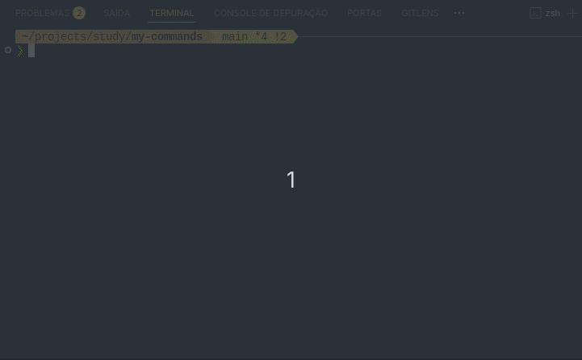

   

# My Commands

> A powerful collection of custom terminal commands designed to automate repetitive tasks, boost productivity, and streamline your development workflow.

## 🎬 Demo


## 📋 Prerequisites

Before installing and running the project, ensure you have the following:

- **PHP 8.1+**: Required runtime environment
- **Composer**: For dependency management
- **Git**: For version control operations
- **OpenAI API Key**: Required for AI-powered features (obtain from [OpenAI's website](https://platform.openai.com/api-keys))

## ✨ Features

- **AI-Powered Git Commits**: Generate semantic commit messages automatically
- **OpenAI Integration**: Send custom prompts and receive AI-generated responses
- **Development Workflow Tools**: Zip directories, manage environment variables, and more
- **Docker Management**: Easily list and stop Docker containers
- **Currency Conversion**: Convert between currencies directly from your terminal
- **Extensible Architecture**: Easily add your own custom commands

## 🚀 Installation

You can install My Commands in two ways:

### Option 1: Using the Installation Script (Recommended)

```bash
# Run the installation script
./install.sh

# Reload your shell configuration
source ~/.zshrc  # or source ~/.bashrc
```

The installation script automatically:
- ✅ Checks if PHP and Composer are installed
- ✅ Installs all dependencies
- ✅ Creates a symbolic link for global access
- ✅ Configures shell autocompletion

### Option 2: Manual Installation

If you prefer step-by-step manual installation:

1. Install dependencies:
   ```bash
   composer install
   ```

2. Create a symbolic link for global access:
   ```bash
   sudo ln -s $(pwd)/bin/console /usr/local/bin/my
   ```

3. Configure shell autocompletion:
   ```bash
   # For Zsh
   echo "source $(pwd)/my-autocomplete.sh" >> ~/.zshrc
   # OR for Bash
   echo "source $(pwd)/my-autocomplete.sh" >> ~/.bashrc
   ```

4. Reload your shell configuration:
   ```bash
   source ~/.zshrc  # or source ~/.bashrc
   ```

## 🔧 Usage

To see all available commands:

```bash
my list
```

### Example Commands

```bash
# Generate AI-powered semantic commit message
my ai:commit

# Ask OpenAI a question
my ai:ask "Write a poem about clean code."

# Convert currency
my currency:convert 100 USD EUR

# Zip current directory
my zip:all

# Manage environment variables
my env:set API_KEY your_api_key_here
my env:unset API_KEY

# Docker operations
my docker:list
my docker:stop-all
```

### Command Autocompletion

Tab completion is automatically activated during installation. Simply type `my` and press <kbd>Tab</kbd> to see available commands.

#### Updating Autocompletion

If you create new commands, regenerate the completion file:

```bash
# Regenerate autocompletion
my completion > my-autocomplete.sh

# Apply changes
source ~/.zshrc  # or source ~/.bashrc
```


## 💻 Development

### Available Commands

| Command | Description |
|---------|-------------|
| `my ai:ask` | Ask a question to OpenAI |
| `my ai:commit` | Generate a semantic commit message |
| `my ai:reset-key` | Reset your OpenAI API key |
| `my currency:convert` | Convert between currencies |
| `my docker:list` | List running Docker containers |
| `my docker:stop-all` | Stop all running Docker containers |
| `my env:set` | Set an environment variable |
| `my env:unset` | Unset an environment variable |
| `my git:soft-revert` | Soft revert Git changes |
| `my git:stash` | Stash Git changes |
| `my git:stash-restore` | Restore stashed Git changes |
| `my zip:all` | Zip the current directory |

### Code Quality

```bash

# Fix code style issues
make check

# Run tests
make test

# Run tests with coverage report
make coverage
```

### Adding New Commands

1. Create a new command class in the `src/Command` directory:

```php
<?php

namespace MyCommands\Command;

use Symfony\Component\Console\Command\Command;
use Symfony\Component\Console\Input\InputInterface;
use Symfony\Component\Console\Output\OutputInterface;

class YourNewCommand extends Command
{
    // Implement your command
}
```

2. Register your command in `bin/console`.

## 🤝 Contributing

Contributions are welcome and appreciated! Here's how you can contribute:

1. Fork the repository
2. Create a feature branch (`git checkout -b feature/amazing-feature`)
3. Commit your changes (`git commit -m 'Add some amazing feature'`)
4. Push to the branch (`git push origin feature/amazing-feature`)
5. Open a Pull Request

## 📝 License

This project is licensed under the [MIT License](LICENSE).

---

Built with ❤️ by [luizalbertobm](https://github.com/luizalbertobm)
